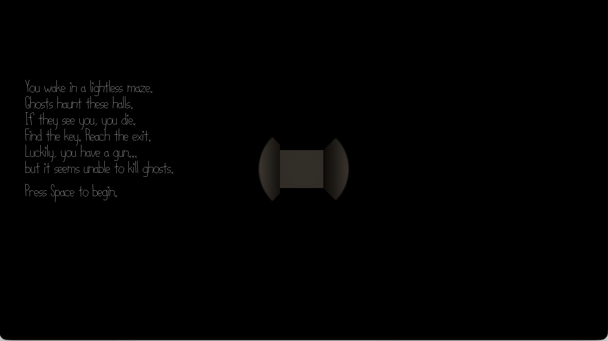

# Hollow Halls

Author: Shuning Liu

Design: A first-person maze where you navigate by flashlight and spatial audio. Ghosts kill you only if they can see you, and your gun cannot hurt them — so escape depends on stealth, timing, and the environment.

Screen Shot:

How To Play:

You wake in a lightless maze. Find the key, then reach the exit — without being seen by the ghosts that haunt the halls.

- **W / S** — move forward / backward
- **A / D** — turn left / right
- **Space** — shoot (and begin the game from the intro)
- **R** — restart

This game was built with [NEST](NEST.md).
